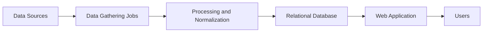

# Architecture Diagram

```mermaid
flowchart LR
    A[Data Sources] --> B[Data Gathering Jobs]
    B --> C[Processing and Normalization]
    C --> D[Relational Database]
    D --> E[Web Application]
    E --> F[Users]
```

This diagram shows the high-level path from external football data sources to the end-user experience presented through MadridStats.
