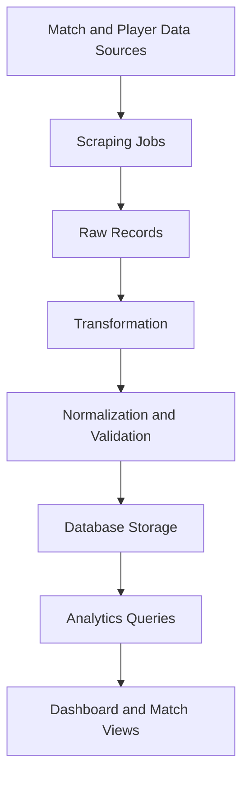

# Data Flow Diagram

```mermaid
flowchart TD
    A[Match and Player Data Sources]
    B[Scraping Jobs]
    C[Raw Records]
    D[Transformation]
    E[Normalization and Validation]
    F[Database Storage]
    G[Analytics Queries]
    H[Dashboard and Match Views]

    A --> B
    B --> C
    C --> D
    D --> E
    E --> F
    F --> G
    G --> H
```

The flow reflects how MadridStats moves data from acquisition into structured user-facing analytics.
