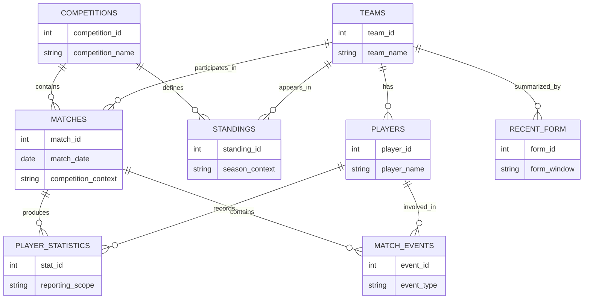

# Conceptual Database Schema

```mermaid
erDiagram
    COMPETITIONS ||--o{ MATCHES : contains
    COMPETITIONS ||--o{ STANDINGS : defines
    TEAMS ||--o{ PLAYERS : has
    TEAMS ||--o{ MATCHES : participates_in
    TEAMS ||--o{ STANDINGS : appears_in
    TEAMS ||--o{ RECENT_FORM : summarized_by
    MATCHES ||--o{ PLAYER_STATISTICS : produces
    MATCHES ||--o{ MATCH_EVENTS : contains
    PLAYERS ||--o{ PLAYER_STATISTICS : records
    PLAYERS ||--o{ MATCH_EVENTS : involved_in

    TEAMS {
        int team_id
        string team_name
    }

    PLAYERS {
        int player_id
        string player_name
    }

    MATCHES {
        int match_id
        date match_date
        string competition_context
    }

    COMPETITIONS {
        int competition_id
        string competition_name
    }

    STANDINGS {
        int standing_id
        string season_context
    }

    PLAYER_STATISTICS {
        int stat_id
        string reporting_scope
    }

    MATCH_EVENTS {
        int event_id
        string event_type
    }

    RECENT_FORM {
        int form_id
        string form_window
    }
```

This is a conceptual schema for documentation purposes. It shows major entities and relationships without exposing private production implementation details.
